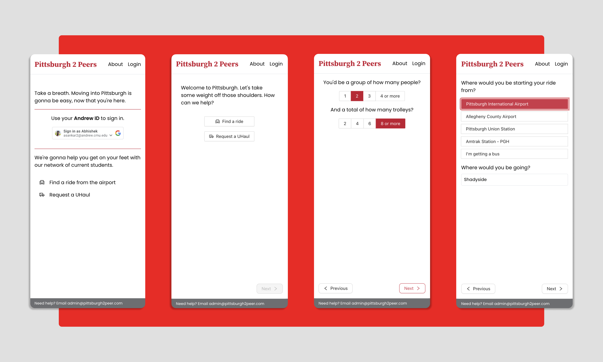
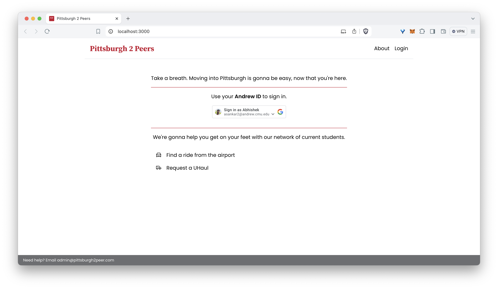

# Pittsburgh 2 Peers

### Motivation

So a lot of us would be landing shortly in Pitt. We wanted to create something to sort out a lot of the logistics of getting settled in.

- Help coordinate students arriving in time buckets to share costs of hailing a ride.
- Getting a ride from the airport to your stay close to campus.
- We're also adding a service to help get a uhaul (and a driver) whilst you arrive on campus.
- Everything is MVP mode, so what gets the job done gets pushed.

### Current status

- We have the flows for requesting a ride, requesting a UHaul and connecting with students who arrive in the same timeslot as you built out.
- We need to authenticate via a google service. Currently, since we'd use this for CMU, we have enabled `andrew.cmu.edu` as the only allowed organization but you can swap out the google client id in the env file for your requirements.

<!--  -->

